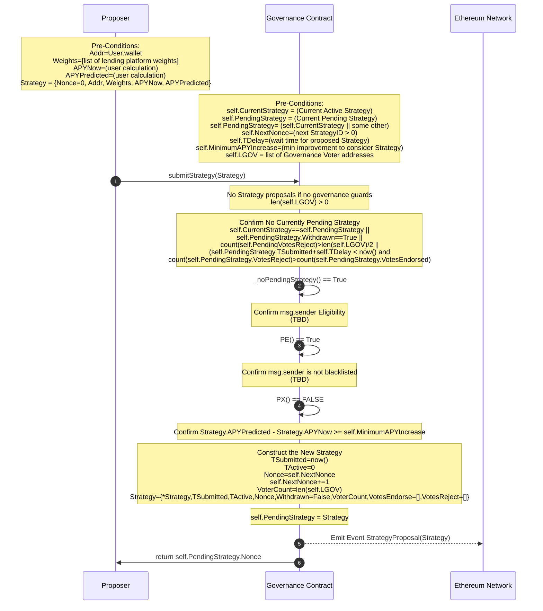
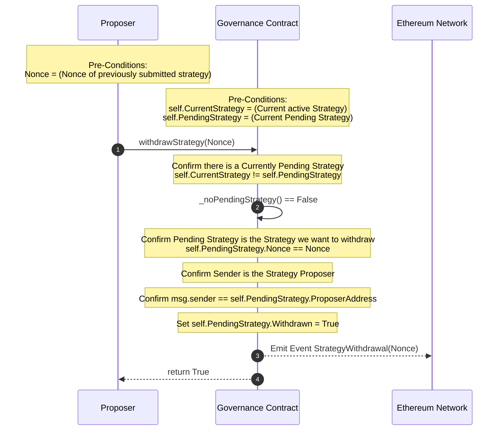
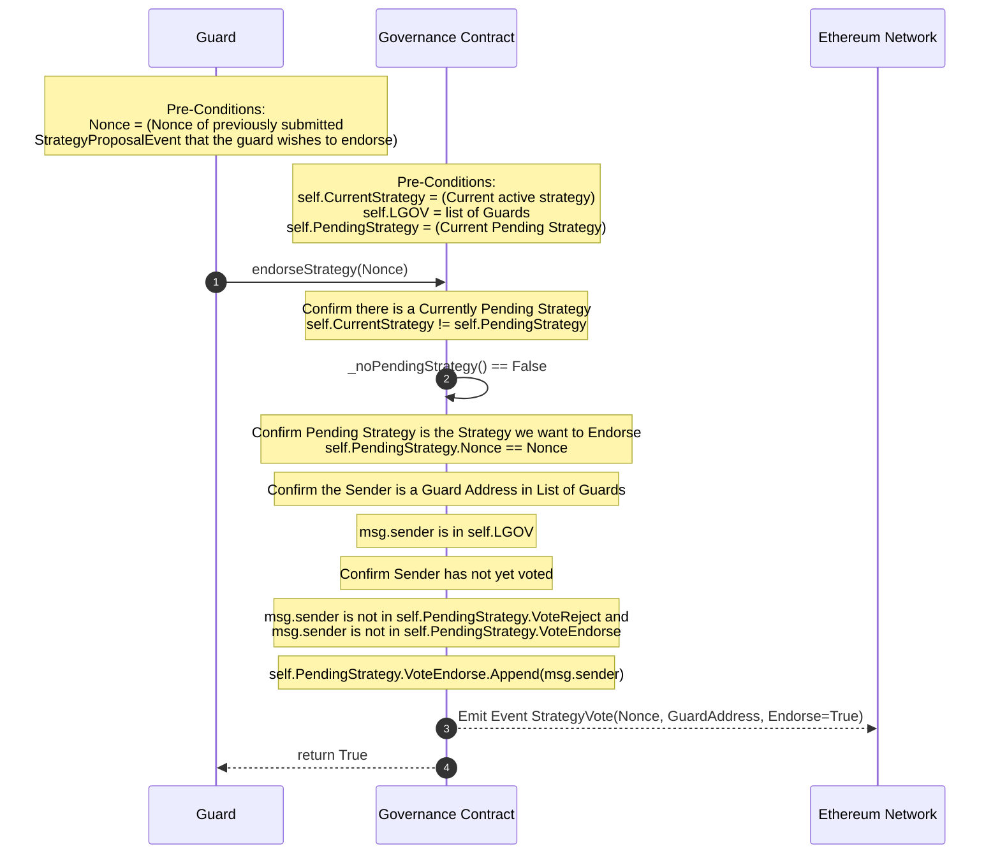
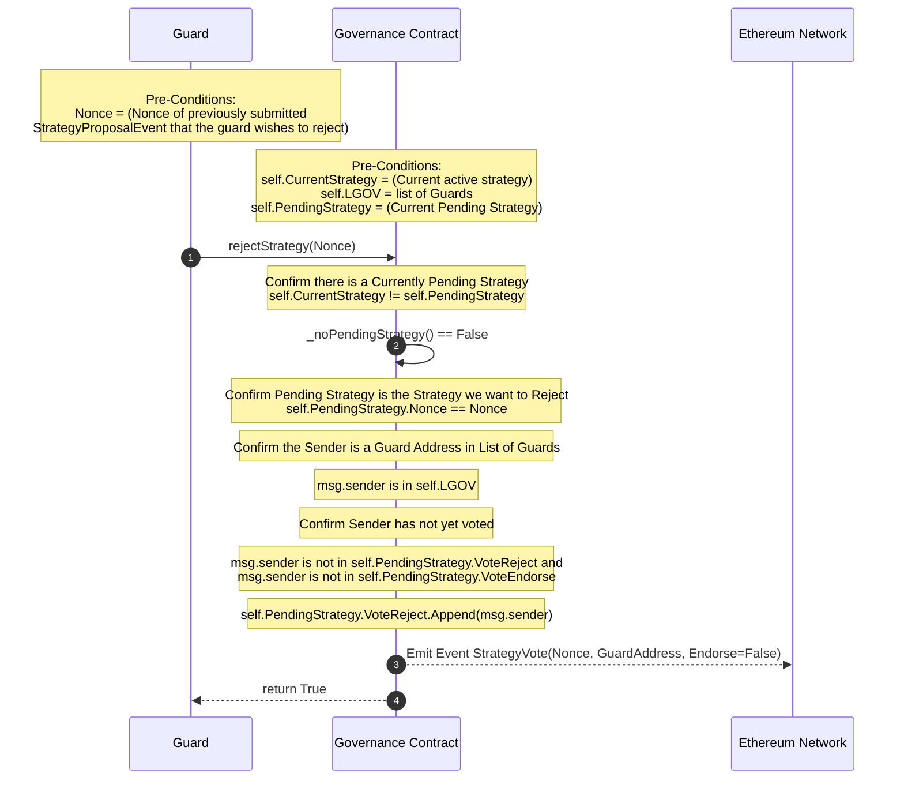
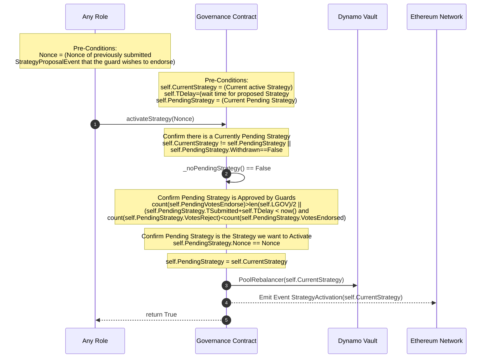
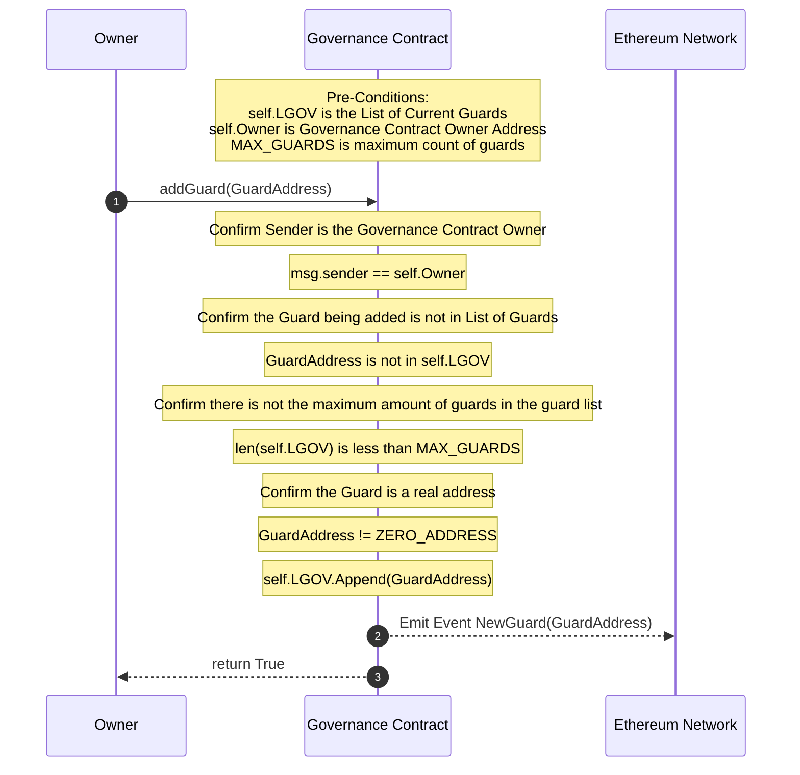
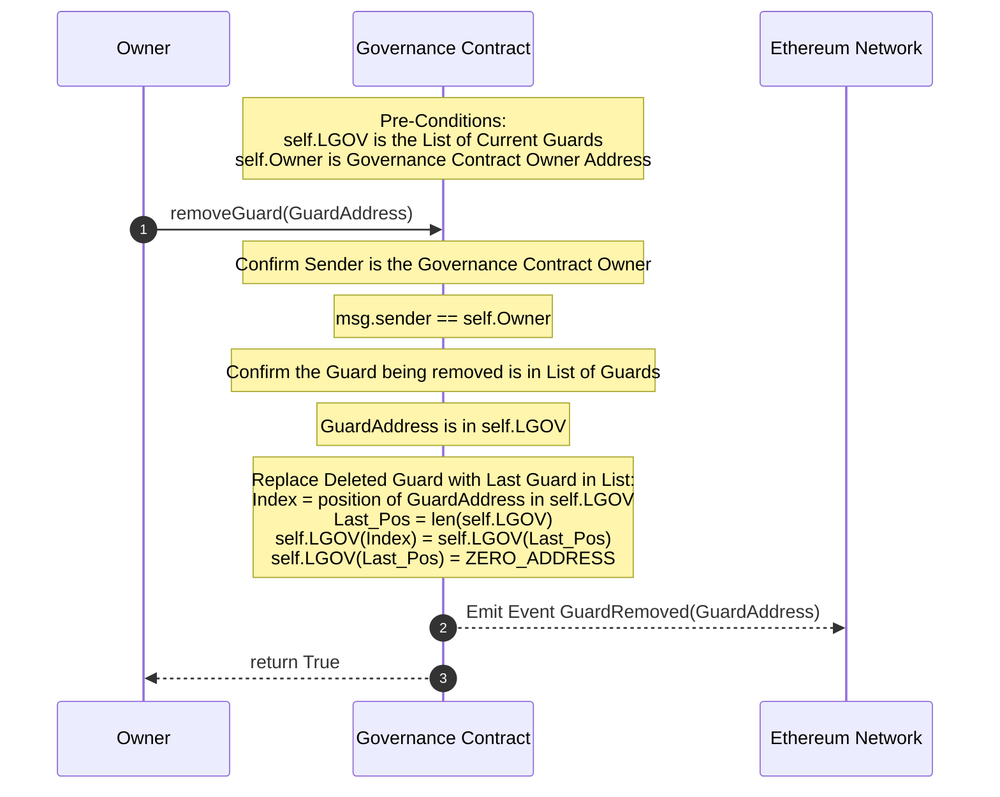
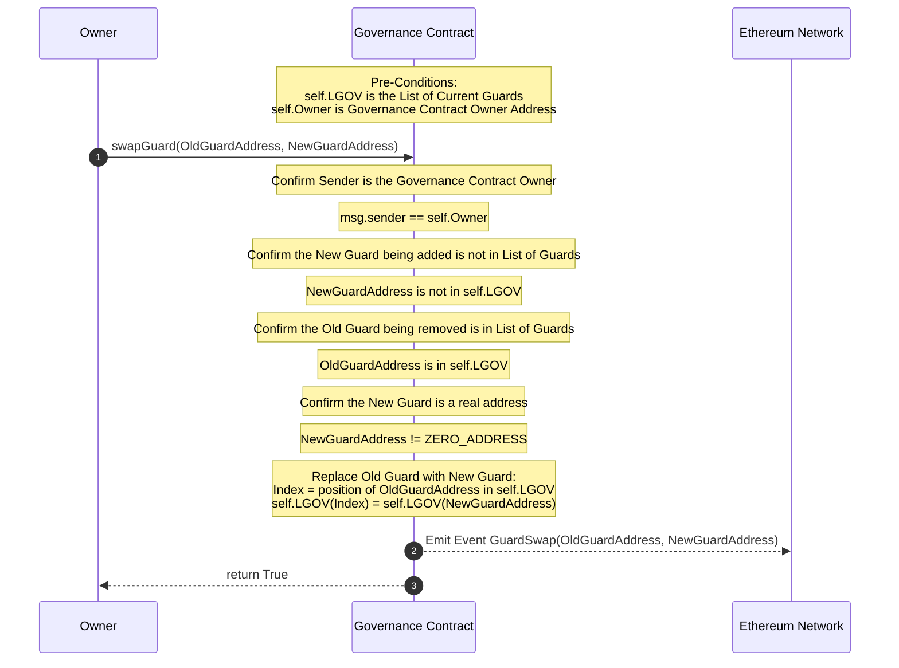

# Dynamo Defi <-> Governance Contract

## Summary

These are sequence diagrams for each function of the Governance Contract. 
The Governance Contract provides a way to submit strategies to rebalance investment pools while using a voting system to approve those said strategies.

## Given

PE = Predicate - Proposer must meet certain qualification for eligibility. (Must resolve to True)

- Ex: hold a certain quantity of vault tokens. TBD

PX = Predicate - Proposer must not be subject to some form of exclusion. (Must resolve to False)

- Ex: having been rejected in last 24 hrs or on a black list. TBD

TDELAY = Variable - How long after a strategy is submitted until it can be activated so long as it is not rejected/overwhelmingly endorsed.

LGOV = Variable - List of addresses of Governance Guards who vote on Strategy Submissions.

Strategy = (Proposed) Struct = { Nonce, Proposer Addr, Weights[], TSUBMITTED, TACTIVATED, len(LGOV), VotesENDORSE, VotesREJECT }

## SubmitStrategy

## WithdrawStrategy

## EndorseStartegy

## RejectStartegy

## ActivateStartegy

## AddGuard

## RemoveGuard

## SwapGuard

